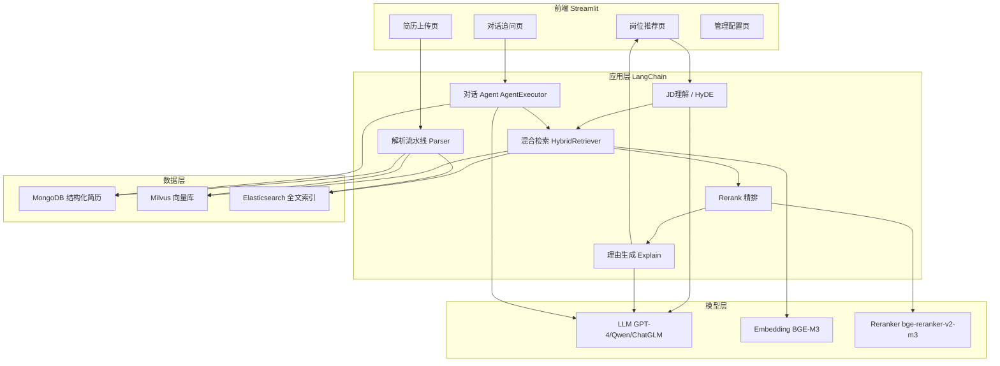
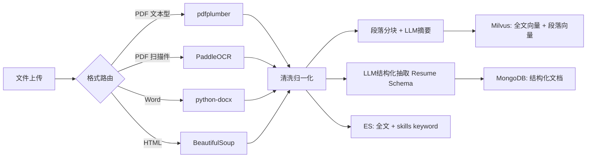

# 基于人力资源场景的 RAG 简历推荐系统 —— 技术方案

> 版本：v1.0
> 技术主线：文档智能 + 向量化与索引 + 检索增强生成（RAG）+ 智能代理 + 配置与 DevOps
> 核心技术栈：LangChain + Milvus + Elasticsearch + MongoDB + Streamlit

---

## 1. 方案概述

### 1.1 目标

构建一个面向 HR 初筛环节的智能简历推荐系统：

1. **多格式简历入库**：PDF / Word / HTML / 图片扫描件 → 解析 → 结构化 → 三库（MongoDB / Milvus / ES）入库。
2. **JD 智能理解**：自然语言岗位描述 → 结构化查询条件 + HyDE 假设文档 → 双路查询。
3. **混合检索 + 融合精排**：Milvus 语义召回 + ES 关键词召回 → RRF 融合 → Reranker 精排 → Top-K。
4. **可解释推荐**：为每位候选人生成匹配理由、匹配点/待提高项、多维雷达图对比。
5. **对话式追问**：基于 Agent 的对话检索，支持过滤、聚合、对比类问题。
6. **可运维**：配置热更新、日志、性能监控、Docker 一键部署。

### 1.2 总体架构图



---

## 2. 关键设计决策（在原需求基础上的补充与优化）

| # | 决策点 | 选型 | 理由 |
|---|--------|------|------|
| 1 | Embedding 模型 | **BGE-M3**（多语言，1024 维，支持稠密+稀疏向量） | 中文简历场景效果远优于 ada-002；稀疏向量可辅助检索；离线可部署，数据安全 |
| 2 | 中文 OCR | **PaddleOCR** 优先，Tesseract 兜底 | 中文识别准确率显著高于 Tesseract |
| 3 | 结构化抽取 | LLM `with_structured_output`（Pydantic Schema）+ 正则兜底 | 比 `create_extraction_chain`（已废弃）更现代；Pydantic 校验保证字段质量 |
| 4 | 融合策略 | **RRF**（Reciprocal Rank Fusion，k=60） | 无需分数归一化，对异构分数鲁棒，工程上最稳 |
| 5 | Rerank | **bge-reranker-v2-m3**（Cross-Encoder），LLM Rerank 作为可选高精度模式 | 本地推理快、成本低；LLM 精排留给 Top-10 精细对比 |
| 6 | LLM 接入 | 统一 **OpenAI 兼容接口**抽象（`ChatOpenAI` 可切换 GPT-4 / Qwen / ChatGLM / Ollama） | 一套代码兼容云端与本地模型，便于降本与私有化 |
| 7 | 对话流式输出 | **打字机效果**：`st.write_stream` + LLM `stream` 模式 | 降低首字等待时间，体验好（产品硬性要求） |
| 8 | 配置管理 | `pydantic-settings` + `config.yaml` + 环境变量覆盖，管理页可热更新 | 比 etcd 轻量，满足当前规模；预留配置中心扩展点 |
| 9 | 分块策略 | **按简历语义段落分块**（基本信息/教育/工作/项目/技能），同时保留全文摘要向量 | 段落级检索可定位匹配点，用于推荐理由高亮 |
| 10 | 硬条件过滤 | JD 解析出的硬性条件（年限/学历/技能）作为 **Milvus/ES 过滤器**，先过滤后排序 | 避免"语义高分但不满足硬性门槛"的误推荐 |

---

## 3. 系统模块设计

### 3.1 模块划分

```
ResumeRAG/
├── app/
│   ├── main.py                    # 应用入口（可选 FastAPI 服务）
│   ├── ui/                        # Streamlit 前端
│   │   ├── Home.py                # 导航首页
│   │   ├── pages/
│   │   │   ├── 1_简历管理.py       # 上传/解析/入库/列表
│   │   │   ├── 2_智能推荐.py       # JD 输入 → Top-K 推荐
│   │   │   ├── 3_对话追问.py       # 聊天界面（打字机效果）
│   │   │   └── 4_管理配置.py       # 参数调整/索引重建/监控
│   ├── core/                      # 核心业务逻辑
│   │   ├── config.py              # pydantic-settings 配置
│   │   ├── models.py              # Pydantic 数据模型（Resume/JDQuery/RecommendResult）
│   │   ├── parsing/               # 文档智能
│   │   │   ├── loader.py          # 格式路由：PDF/Word/HTML/图片
│   │   │   ├── ocr.py             # PaddleOCR / Tesseract
│   │   │   ├── splitter.py        # 按简历段落分块
│   │   │   └── extractor.py       # LLM 结构化抽取（Pydantic Schema）
│   │   ├── retrieval/             # 检索链路
│   │   │   ├── jd_parser.py       # JD → 结构化查询 + HyDE
│   │   │   ├── milvus_retriever.py
│   │   │   ├── es_retriever.py
│   │   │   ├── fusion.py          # RRF 融合
│   │   │   ├── reranker.py        # Cross-Encoder / LLM Rerank
│   │   │   └── hybrid_pipeline.py # 编排完整 RAG 管道
│   │   ├── generation/            # 生成层
│   │   │   ├── explainer.py       # 推荐理由生成
│   │   │   └── prompts.py         # Prompt 模板集中管理
│   │   ├── agent/                 # 对话智能代理
│   │   │   ├── tools.py           # 检索工具/过滤工具/Mongo聚合工具
│   │   │   └── chat_agent.py      # AgentExecutor + Memory
│   │   └── infra/                 # 基础设施客户端
│   │       ├── mongo_client.py
│   │       ├── milvus_client.py
│   │       ├── es_client.py
│   │       └── llm_factory.py     # LLM/Embedding/Reranker 统一工厂
│   └── tests/
├── data/                          # 示例简历与 JD
├── config/config.yaml
├── docker-compose.yml             # Milvus + ES + MongoDB + App
├── Dockerfile
├── requirements.txt
└── README.md
```

### 3.2 数据模型（Pydantic）

```python
class EducationItem(BaseModel):
    school: str
    major: str
    degree: Literal["大专", "本科", "硕士", "博士", "其他"]
    start: str; end: str

class ExperienceItem(BaseModel):
    company: str; title: str
    start: str; end: str
    description: str

class Resume(BaseModel):
    name: str | None
    phone: str | None
    email: str | None
    education: list[EducationItem]
    experience: list[ExperienceItem]
    skills: list[str]
    years_of_experience: float | None
    summary: str | None          # LLM 生成的简历摘要

class JDQuery(BaseModel):
    """LLM 解析 JD 的输出"""
    must_skills: list[str]       # 硬性技能
    nice_skills: list[str]       # 加分技能
    min_years: float | None
    min_degree: str | None
    keywords: list[str]          # 扩展查询词（同义词/近义词）
    intent_summary: str
```

### 3.3 模块一：简历智能解析与入库

**流水线：**



**要点：**

- 格式识别：优先用文件扩展名，PDF 再用 `pdfplumber` 检测文本层，无文本层则走 OCR。
- 结构化抽取 Prompt 要求 LLM 输出严格 JSON（`with_structured_output(Resume)`），抽取失败降级为正则（手机号/邮箱/学历关键词）。
- 每份简历写入两类向量：`doc_type="full"`（全文摘要向量，用于整体匹配）与 `doc_type="section"`（段落向量，用于匹配点定位）。
- 三库通过 `resume_id`（UUID）关联，写入采用"先 Mongo 拿 ID，再写 Milvus/ES"，失败可重试补偿。

### 3.4 模块二：JD 理解与查询构建

1. **结构化解析**：LLM 输出 `JDQuery`（硬技能/加分项/年限/学历/扩展同义词）。
2. **HyDE**：LLM 生成"理想候选人简历摘要"（300 字内），向量化后作为语义查询，与 JD 原文向量加权平均（默认 HyDE 权重 0.7，可配置）。
3. **双路查询构建**：
   - Milvus：ANN 查询 + `expr` 过滤器（如 `years >= 5`，学历映射为数值等级过滤）。
   - ES：`bool` 查询 —— `must`（硬技能 terms/`ik_smart` match）+ `should`（加分技能提权）+ `filter`（年限范围）。

### 3.5 模块三：多路召回与融合排序

```text
Milvus ANN Top-N=100  ──┐
                        ├─→ RRF 融合(k=60) ─→ 去重 ─→ Cross-Encoder 精排 ─→ Top-K(默认10)
ES BM25 Top-N=100    ──┘                                    ↓
                                             LLM 生成匹配理由(仅对 Top-K)
```

- **RRF 公式**：`score(d) = Σ 1 / (k + rank_i(d))`，跨召回路求和。
- **Rerank**：`bge-reranker-v2-m3` 对 (JD, 简历全文) 逐对打分；配置开关可切换为 LLM pairwise/listwise 精排（成本高，仅 Top-10 内使用）。
- **匹配度分数归一化**：最终展示分 = `0.6 * rerank分 + 0.4 * RRF归一分`，映射到 0–100。

### 3.6 模块四：推荐理由生成与可视化

- Prompt 输入：JD 结构化条件 + 候选人结构化字段 + 检索命中的高分段落。
- 输出结构化 JSON：`{匹配项: [...], 待提高项: [...], 综合评语: "...", 匹配技能高亮: [...]}`。
- 前端：
  - `st.metric` 展示匹配分、年限、学历；
  - `st.expander` 展示推荐理由与匹配点高亮；
  - **Plotly 雷达图**：技能匹配 / 经验年限 / 学历 / 项目相关度 / 行业背景 五维对比（支持勾选 2–4 人对比）。

### 3.7 模块五：对话式检索智能代理

- `create_react_agent` / `AgentExecutor` + `ConversationBufferWindowMemory`（近 10 轮）。
- 工具集：
  | 工具 | 说明 |
  |------|------|
  | `semantic_search` | 语义检索全库/当前推荐子集 |
  | `keyword_search` | ES 关键词检索 |
  | `filter_search` | 按字段过滤（技能/学历/年限） |
  | `mongo_aggregate` | 聚合统计（如"本科以上候选人数量"），**只允许白名单集合与管道**，防注入 |
  | `current_candidates` | 读取当前推荐上下文 |
- **流式输出（打字机效果）**：Agent 最终回答使用 LLM streaming，前端 `st.write_stream` 逐 token 渲染。

### 3.8 模块六：配置与 DevOps

- `config.yaml` + 环境变量覆盖；管理页修改后写入并重载（热更新召回数 N、Top-K、RRF k、Rerank 开关、模型端点）。
- 索引管理：一键重建 Milvus 集合 / ES 索引（blue-green：建新索引 → 别名切换）。
- 日志：`loguru` 结构化日志，记录每阶段耗时（解析/召回/融合/精排/生成）。
- 监控：`prometheus-client` 暴露指标（检索延迟 P95、召回命中数、LLM token 消耗），Grafana 面板（可选）。
- Docker Compose 编排：mongod、elasticsearch（含 ik 插件）、milvus（standalone: etcd+minio+milvus）、app。

---

## 4. 数据库设计

### 4.1 MongoDB `resumes`

```json
{
  "_id": ObjectId,
  "resume_id": "uuid",
  "name": "张三", "phone": "...", "email": "...",
  "education": [{"school":"...","major":"...","degree":"本科","start":"2014","end":"2018"}],
  "experience": [{"company":"...","title":"...","start":"...","end":"...","description":"..."}],
  "skills": ["Python", "Kubernetes"],
  "years_of_experience": 6.5,
  "summary": "LLM 生成摘要",
  "full_text": "原始全文",
  "parsed_metadata": {"source_file": "xxx.pdf", "parser": "pdfplumber", "ocr": false, "confidence": 0.95},
  "upload_time": ISODate
}
```

### 4.2 Milvus `resume_embeddings`

| 字段 | 类型 | 说明 |
|------|------|------|
| pk | Int64（自增） | 主键 |
| resume_id | VarChar(64) | 关联 MongoDB |
| embedding | FloatVector(1024) | BGE-M3 稠密向量 |
| doc_type | VarChar(16) | `full` / `section` |
| section_name | VarChar(64) | 段落名（教育/工作/项目…） |
| text | VarChar(4096) | 段落原文（供高亮） |

索引：HNSW（M=16, efConstruction=200），度量 COSINE。

### 4.3 Elasticsearch `resumes`

```json
{
  "mappings": {
    "properties": {
      "resume_id": {"type": "keyword"},
      "name": {"type": "keyword"},
      "full_text": {"type": "text", "analyzer": "ik_max_word", "search_analyzer": "ik_smart"},
      "skills": {"type": "keyword"},
      "degree": {"type": "keyword"},
      "years_of_experience": {"type": "integer"},
      "upload_time": {"type": "date"}
    }
  }
}
```

---

## 5. 核心接口设计（供前端调用的服务层 API）

| 方法 | 功能 | 返回 |
|------|------|------|
| `ingest(files: list[UploadFile])` | 批量解析入库 | 每份简历的解析结果与状态 |
| `parse_jd(jd_text: str) -> JDQuery` | JD 理解 | 结构化查询条件（前端可预览/修正） |
| `recommend(jd_query, top_k, filters) -> list[RecommendResult]` | 完整 RAG 管道 | Top-K 候选人 + 分数 + 理由 |
| `compare(resume_ids) -> RadarData` | 多人对比 | 雷达图数据 |
| `chat(question, session_id) -> AsyncIterator[str]` | 对话追问（流式） | 打字机效果 token 流 |
| `get_config() / update_config(patch)` | 配置读写 | 配置项 |
| `rebuild_index(target)` | 索引重建 | 任务状态 |

---

## 6. 非功能设计

| 项 | 方案 |
|----|------|
| 性能 | 双路召回并发（`asyncio.gather`）；Rerank 仅对融合后 ≤60 条；Top-20 检索目标 < 3s（不含 LLM 理由生成，理由生成走流式） |
| 扩展性 | Milvus 支持分片扩容；入库管道与查询解耦，百万级可引入 Celery 异步队列 |
| 安全 | 简历字段落库前可配置脱敏（手机号/邮箱 AES 加密存储）；管理页口令保护；Mongo 聚合白名单 |
| 可观测 | 全链路耗时埋点 + Prometheus 指标 + loguru 日志 |
| 评测 | 构建 50 条 JD↔简历标注集，用 Recall@K / nDCG@K / MRR 回归评测；Prompt 变更前后对比 |

---

## 7. 实施计划（迭代分解）

| 迭代 | 内容 | 交付物 | 周期 |
|------|------|--------|------|
| T1 | 环境搭建：docker-compose（Milvus/ES+ik/Mongo）、配置框架、三库客户端封装 | 可连通的基础设施 | 3 天 |
| T2 | 解析流水线：格式路由 + OCR + LLM 结构化抽取 + 三库入库；简历管理页 | 上传即可查询 | 5 天 |
| T3 | 单路检索：BGE-M3 向量化 + Milvus ANN 检索 + JD 解析 | 基础推荐可用 | 4 天 |
| T4 | 混合检索：ES 召回 + RRF 融合 + Reranker 精排 + 硬性条件过滤 | 完整推荐管道 | 5 天 |
| T5 | 推荐理由生成 + Streamlit 推荐页（卡片/雷达图/高亮） | 可解释推荐界面 | 4 天 |
| T6 | 对话 Agent：工具封装 + Memory + 打字机流式输出 | 对话追问页 | 4 天 |
| T7 | 管理配置页、监控埋点、Docker 部署、评测集与调优 | 可部署版本 | 5 天 |

---

## 8. 风险与对策

| 风险 | 对策 |
|------|------|
| 简历版式多样，解析质量不稳定 | 解析置信度评分 + 失败样本人工复核队列；解析结果前端可编辑修正后重新入库 |
| LLM 抽取幻觉（编造技能/年限） | 抽取字段与原文交叉校验（关键词回查），低置信字段标记为 null |
| 本地模型推理慢 | Embedding/Reranker 用 GPU 或 ONNX 量化；LLM 理由生成流式化；批量请求合并 |
| 资源占用高（Milvus+ES+Mongo 同机） | 提供精简档：小规模可用 Milvus Lite + ES 替换为 OpenSearch lite，或先用 FAISS 验证再切 Milvus |
| HyDE 生成偏差导致召回偏移 | HyDE 与原文向量加权融合而非替换；权重可配置，评测集回归验证 |
